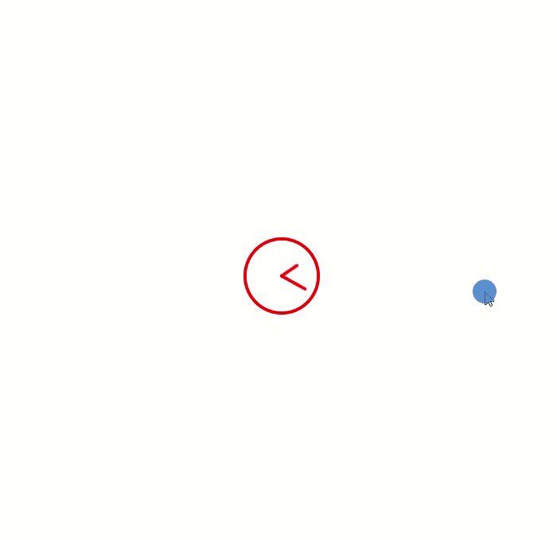

This directory contains 2 major tasks.

The 1st task represents a static web page that was made from the provided Figma design.

## Features:
- Responsivity. The site is optimized to work well on a variety of screen sizes and devices;
- It works good in Chrome, Firefox, Safari, Edge, Opera browsers;
- The BEM is used;
- Rows in the table are highlighted on hover, also added cursor pointer to the icons

## Local deployment

- Clone repository;
- Open `clonify-and-clock-animation/clonify` directory;
- Open index.html

## Demo

--------------------------------------------------------------------------------------------

The 2nd task represents a static web page with animation on the clock's hands.
CSS animation was used.

## Local deployment

- Clone repository;
- Open `clonify-and-clock-animation/clock-animation` directory;
- Open index.html

## Demo

