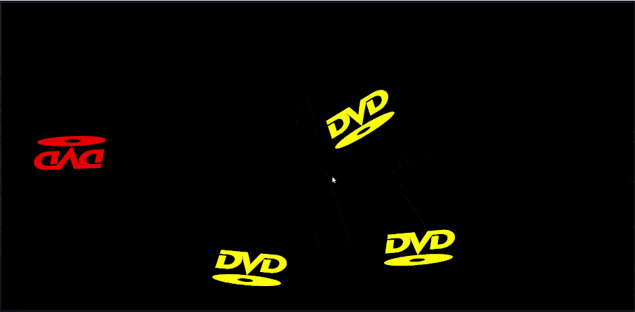

This directory contains a static web page representing multiple DVD logos bouncing with the screen borders.

## Features:
- 4 logos;
- Collisions are handled;
- Color is changed after every hit;
- Sound is triggered after every hit;
- Velocity is random for every logo;

## Local deployment

- Clone repository;
- Open `dvd-logo-animation/2d-multiple-logos` directory;
- Run any server for serving this directory. For example, with VSCode LiveServer (see demo):
  - Open `index.html` in VSCode;
  - Click "Go Live" to execute the server;
  - Localhost should be opened automatically (e. g. http://127.0.0.1:5500/) in the browser;
- Allow sounds for opened page (Site Settings -> Sound -> Allow). Otherwise sound won't be played, 
since browsers restrict playing sound without interation with the page or explicit allowing in the settings.

## Demo

## Design

This work doesn't use CSS for animation. Instead, it uses physical engine `matter.js` to emulate movements and collisions.
All logos are placed on canvas.
