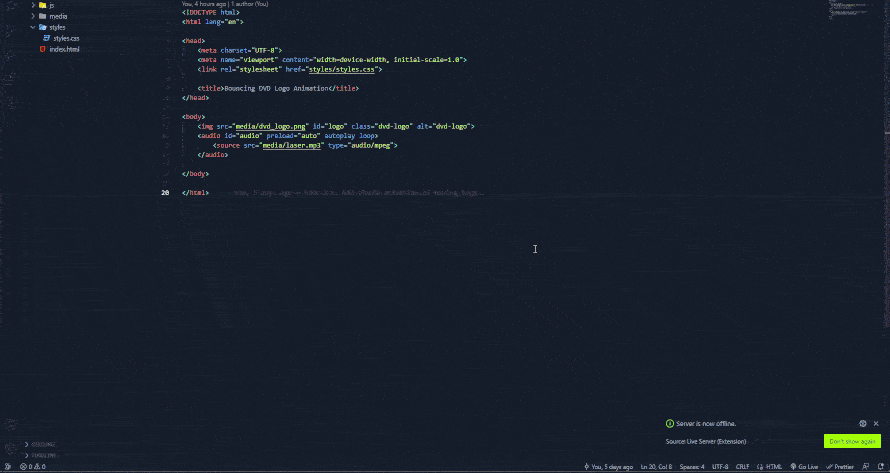

This directory contains a static web page representing DVD logo bouncing with the screen borders.

## Features:
- Color is changed after every hit;
- Sound is triggered after every hit;
- Responsivity

## Local deployment

- Clone repository;
- Open `dvd-logo-animation/2d-single-logo` directory;
- Run any server for serving this directory. For example, with VSCode LiveServer (see demo):
  - Open `index.html` in VSCode;
  - Click "Go Live" to execute the server;
  - Localhost should be opened automatically (e. g. http://127.0.0.1:5500/) in the browser;
- Allow sounds for opened page (Site Settings -> Sound -> Allow). Otherwise sound won't be played, 
since browsers restrict playing sound without interation with the page or explicit allowing in the settings.

## Demo

## Known issues

### Autoplay isn't allowed by modern browsers

Ability to play sound from CSS or JS is blocked by modern browser. User should interact with the page (e. g. click) or explicitly allow sounds.
This work supposes the second option.

### Triggering the sound is impossible with CSS

There is no way to trigger sound with CSS. In this work I tried:
- <embed> tag and switching `display` attribute: it works, but only during first switch from `none` to `block`.
Over attempts fail, since autoplay doesn't work for embed;
- <audion> tag and switching `display` attribute: it plays sound even being hidden;
- <iframe> tag and switching `display` attribute: autoplay doesn't work at all
  
In this work I modified audio file to be the same length as animation and say "beep" in accordance with hits.
JS version without any hacks could be enabled by switching to commit "7522b54d99bc4776182a24e80828ffe475d08ab2".
