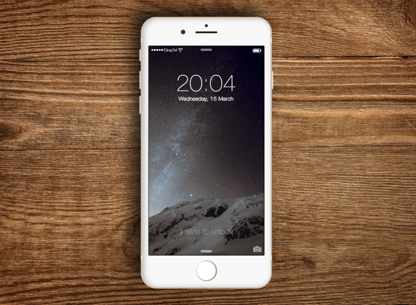

This repository contains a static web page representing an iPhone 6 lying on a wooden table.

## Features:
- responsivity;
- the screen shows a real time and date;
- ability to swipe left and right the screen;
- enter passcode (it behaves as if it's always wrong);
- passcode area vibrates (visually) after entering digits

## Local deployment

- Clone repository;
- Open `smartphone` directory;
- Open `index.html`

## Demo

